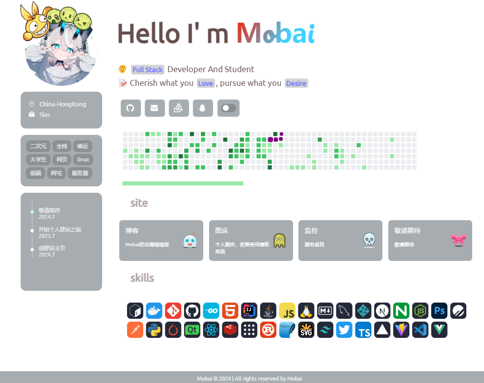
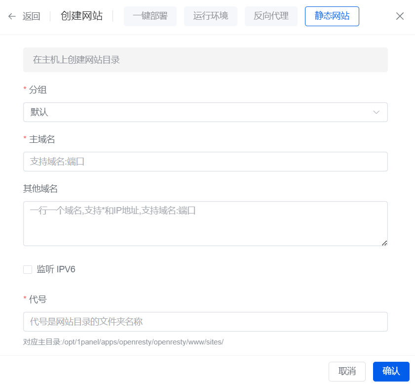

# 个人主页界面

## 基本介绍

> 项目参考：
>
> https://github.com/ZYYO666/homepage
>
> 本站点主要是改造和DIY，觉得好看的可以自行修改（`需要部分前端知识`）,喜欢我都样式也可以直接套用，记得修改头像等基本信息，再次强调自行DIY`需要部分前端知识`！你也可以借助GPT等帮你修改。

演示站点:

https://www.loliowo.com

效果如图示范：

## 1panel安装

> 你也可以手搓，具体看你自己的选择了

### 创建静态网站

> 先用域名创建好静态网站就好，先不用上传

### 上传文件

> 上传之后解压即可：然后就可以了，配置好https，就没什么需要做的了，自行DIY即可

	

> 对，就是这么简单，如果本地跨域问题记得使用`http-server`等服务。
